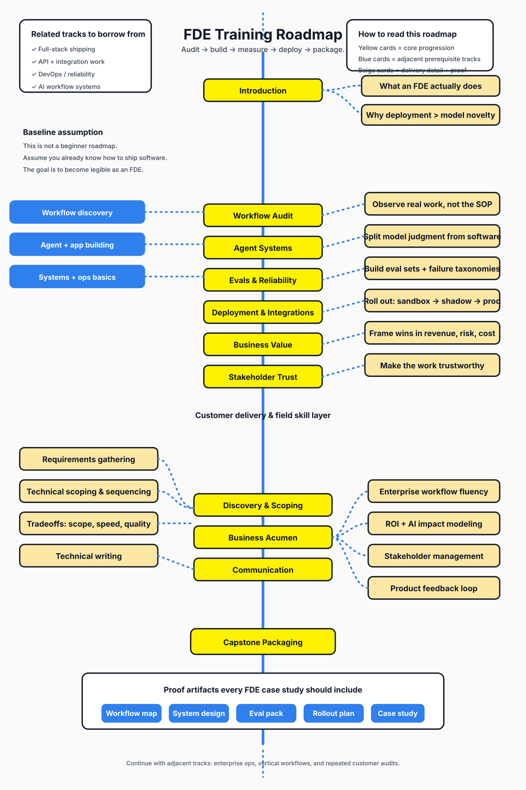

# Awesome FDE Training Lab

> A curated and **opinionated** codebase for becoming an AI Forward Deployed Engineer.

This repository is designed around one principle: **do the job before you have the title**.

It combines a README-first curated guide, a runnable CLI, hands-on labs, packaging templates, and a concrete 30/90-day path so a builder can turn existing technical skill into visible FDE proof.

Inspired structurally by [awesome-cto](https://github.com/kuchin/awesome-cto).

## Contents

* [What FDE work looks like](#what-fde-work-looks-like)
* [Core skill areas](#core-skill-areas)
* [Training roadmap](#training-roadmap)
* [Visual roadmap](#visual-roadmap)
* [Capstone labs](#capstone-labs)
* [Proof artifacts](#proof-artifacts)
* [Templates](#templates)
* [Curated resources](#curated-resources)
* [CLI](#cli)
* [Repo structure](#repo-structure)
* [Source material](#source-material)
* [Related stuff](#related-stuff)

## What FDE work looks like

* [Product brief](docs/product-brief.md) - the thesis for this repo and the target transformation.
* [Assessment rubric](docs/assessment-rubric.md) - the standard for whether a project actually looks like FDE work.
* [Source notes from Greg Isenberg + Voss](docs/source-notes/greg-isenberg-fde-video.md) - transcript-grounded takeaways from the seed video.
* [Forward Deployed Engineering 101 — Kevin Bai](docs/source-notes/kevin-bai-fde-101.md) - grounded notes on when FDE is actually the right GTM / deployment motion.
* [Implementation plan](docs/plans/2026-07-20-fde-training-lab-implementation-plan.md) - the next buildout plan for making this repo more complete.

## Core skill areas

* **Workflow Audit** - map how work really happens, including stakeholders, exceptions, bottlenecks, and approvals.
* **Agent Systems** - build real-loop AI systems with tools, traces, and deliberate boundaries between software, model judgment, and human review.
* **Evals and Reliability** - define golden datasets, failure taxonomies, and measurable pass/fail criteria.
* **Deployment and Integration** - roll systems out through sandbox, shadow mode, controlled autonomy, and production.
* **Business Value and Trust** - explain the work in ROI, risk, and adoption language that non-technical stakeholders will sign off on.
* **Capstone Packaging** - turn the project into case-study-grade evidence instead of a demo with vibes.

See also:
* [Training modules](curriculum/modules.md)
* [Workshop labs](curriculum/workshop-labs.md)

## Training roadmap

* [30-Day FDE Plan](curriculum/30-day-plan.md) - the shortest credible path to one real FDE-style capstone.
* [90-Day FDE Acceleration Plan](curriculum/90-day-acceleration-plan.md) - deepen from one capstone into repeatable delivery.
* [Verification guide](docs/verification.md) - exact install and validation commands.

## Visual roadmap

* [Visual roadmap + proof stack](docs/visual-roadmap.md) - static diagrams inspired by roadmaps.sh for the training path and capstone artifact stack.
* 

## Capstone labs

* [Audit a messy workflow](curriculum/workshop-labs.md) - build an operating map instead of a superficial automation idea.
* [Design a guarded agent system](curriculum/workshop-labs.md) - include traces, approvals, and failure handling.
* [Build an eval pack](curriculum/workshop-labs.md) - prove the system is reliable enough to discuss deployment.
* [Package the case study](curriculum/workshop-labs.md) - make the work legible to founders, clients, and hiring managers.

## Proof artifacts

A strong FDE portfolio item should include:

* workflow map
* system architecture
* trace sample
* golden dataset
* failure taxonomy
* eval summary
* deployment / rollout plan
* business case
* stakeholder pitch

If one of these is missing, the project is probably still a prototype rather than FDE proof.

## Templates

* [Workflow audit template](templates/workflow-audit-template.md) - capture the current-state process with operational reality.
* [Eval report template](templates/eval-report-template.md) - measure readiness with evidence, not feelings.
* [Client / stakeholder pitch template](templates/client-pitch-template.md) - frame the work in decision-maker language.

## Curated resources

* [Curated FDE resources](docs/curated-resources.md) - a README-friendly, opinionated list of external references and internal guides.
* [Visual roadmap + proof stack](docs/visual-roadmap.md) - static diagrams for the training path and the evidence stack.

Highlights:
* [Building Effective Agents](https://www.anthropic.com/engineering/building-effective-agents)
* [OpenAI Evals: getting started](https://cookbook.openai.com/examples/evaluation/getting_started_with_openai_evals)
* [The Twelve-Factor App](https://12factor.net/)
* [Google SRE Book](https://sre.google/sre-book/table-of-contents/)

## CLI

### Quick preview without installing
```bash
PYTHONPATH=src python3.11 -m fde_training_lab roadmap
PYTHONPATH=src python3.11 -m fde_training_lab modules
PYTHONPATH=src python3.11 -m fde_training_lab resources
```

### Editable install
```bash
cd fde-training-lab
# If .venv already exists from an older interpreter, move it aside first.
mv .venv .venv-py39-backup 2>/dev/null || true
python3.11 -m venv .venv
source .venv/bin/activate
python3.11 -m pip install -e .
python3.11 -m fde_training_lab roadmap
python3.11 -m fde_training_lab modules
python3.11 -m fde_training_lab resources
python3.11 -m fde_training_lab module workflow-audit
python3.11 -m fde_training_lab scorecard
```

Available commands:

```bash
python3.11 -m fde_training_lab roadmap          # 30-day sprint overview
python3.11 -m fde_training_lab modules          # list modules
python3.11 -m fde_training_lab resources        # print the curated resource map
python3.11 -m fde_training_lab module <slug>    # inspect one module
python3.11 -m fde_training_lab week <1-4>       # week-by-week focus
python3.11 -m fde_training_lab prompt <slug>    # copy/paste AI prompt for a module
python3.11 -m fde_training_lab scorecard        # FDE readiness rubric
```

## Repo structure

```text
fde-training-lab/
  README.md
  assets/
  curriculum/
  docs/
  src/fde_training_lab/
  templates/
  tests/
  _config.yml
```

This repo is intentionally README-first, like an awesome list, but keeps a runnable codebase attached so the learning path can be exercised instead of only read.

## Source material

* [FDE: The $1M/Year AI Job Explained](https://www.youtube.com/watch?v=zXysLUTLjw4) - seed source for the first version of this training lab.
* [Forward Deployed Engineering 101 — Kevin Bai, Anthropic, ex Palantir & Rippling Founding FDE](https://www.youtube.com/watch?v=KwhgfwOSToQ) - strong explanation of when the FDE motion is structurally necessary.
* [Transcript-grounded notes: Greg Isenberg + Voss](docs/source-notes/greg-isenberg-fde-video.md) - extracted and synthesized from the seed source.
* [Transcript-grounded notes: Kevin Bai FDE 101](docs/source-notes/kevin-bai-fde-101.md) - practical framing for platform requirements, GTM fit, and the customer-facing engineer profile.

## Related stuff

* [awesome-cto](https://github.com/kuchin/awesome-cto) - structural inspiration.
* [GitLab Handbook](https://about.gitlab.com/handbook/) - strong example of operating transparency and process legibility.
* [danluu/post-mortems](https://github.com/danluu/post-mortems) - useful for operational thinking and failure analysis.
