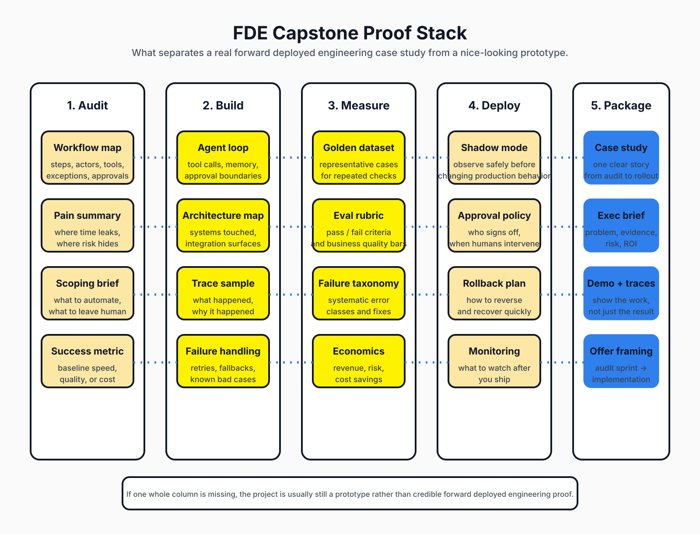

# Visual Roadmap

This page adds GitHub-friendly static diagrams for the repo, inspired by the *structure* of roadmaps.sh rather than trying to clone its exact UI.

The goal is simple:
- keep the repo README-first like an awesome list
- make the progression legible at a glance
- show what “good FDE proof” actually includes

## 1) FDE training roadmap

### Reading guide
- **Yellow cards** are the core sequence.
- **Blue cards** are adjacent tracks or prerequisite muscles.
- **Beige cards** are delivery details, customer-facing concerns, and proof expectations.
- The **vertical spine** is the main progression from understanding the role to packaging a capstone.

### Core flow
1. Introduction
2. Workflow Audit
3. Agent Systems
4. Evals & Reliability
5. Deployment & Integrations
6. Business Value
7. Stakeholder Trust
8. Capstone Packaging

This mirrors the repo’s main belief: the shortest path to becoming legible as an FDE is not more theory — it is one audited, measured, deployment-aware workflow system packaged as evidence.

## 2) Capstone proof stack

This second diagram answers a different question:

**What artifacts turn a project into real FDE proof?**

The five columns are:
1. **Audit** — workflow map, pain summary, scope, success metric
2. **Build** — agent loop, architecture, traces, failure handling
3. **Measure** — golden dataset, eval rubric, failure taxonomy, economics
4. **Deploy** — shadow mode, approvals, rollback, monitoring
5. **Package** — case study, exec brief, demo, offer framing

## Why static SVGs?

Because they:
- render cleanly on GitHub
- work in GitHub Pages without extra build tooling
- stay readable in PRs and markdown previews
- are easy to update later if the curriculum evolves

## Recommended use

If you are actually using this repo as a training plan:
- start with the **30-day plan** for sequencing
- use the **roadmap SVG** for the big picture
- use the **proof stack SVG** as a final QA checklist before calling a project “FDE-ready”

## Related docs
- [README](../README.md)
- [30-Day FDE Plan](../curriculum/30-day-plan.md)
- [90-Day FDE Acceleration Plan](../curriculum/90-day-acceleration-plan.md)
- [Curated FDE resources](curated-resources.md)
- [Assessment rubric](assessment-rubric.md)
